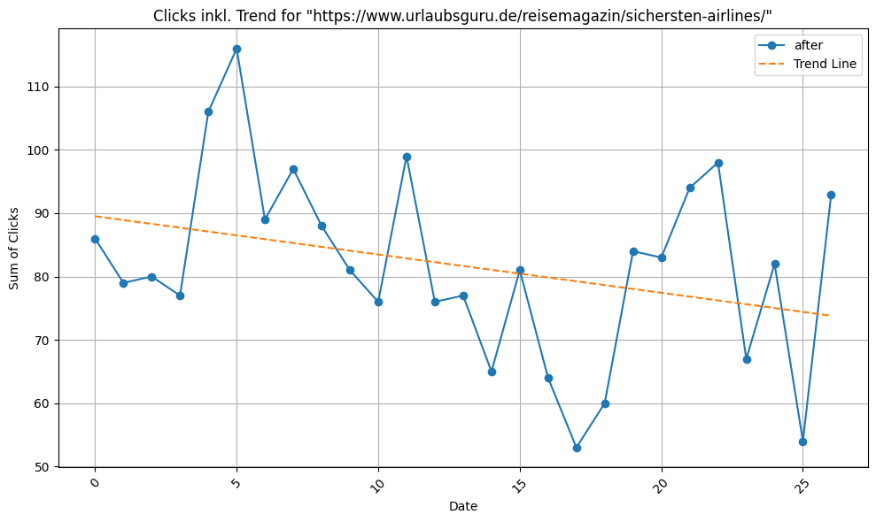
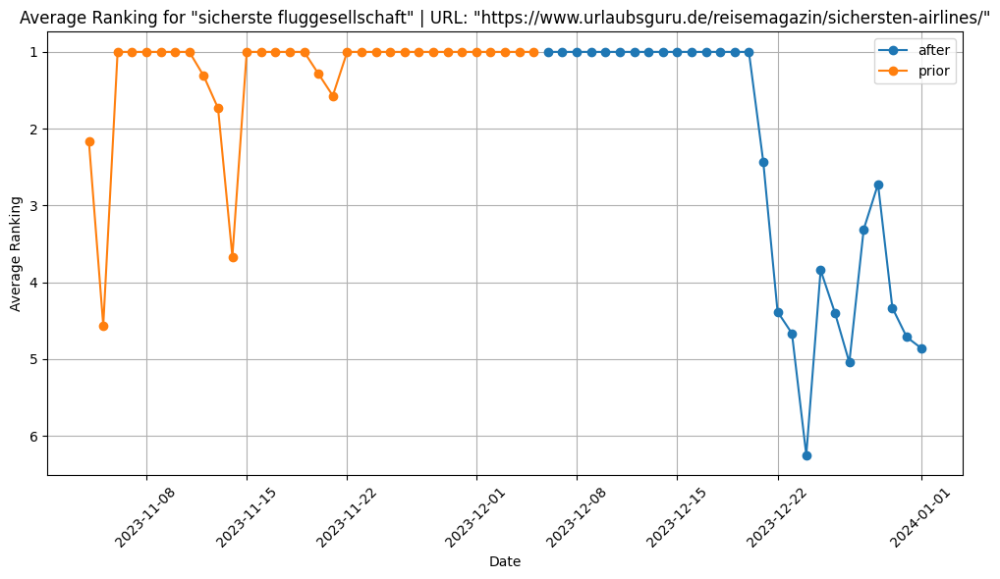

# SEO Data Analytics Scripts
Currently using many different python script in order to answer very specific analytics questions. In this repo are my top ones - read some informations below.

## Top Query within Title / H1 Tag?
Had good success with updating / adding additional keywords from the top queries to title and / or h1 tag. The script does the following:
- Fetch current GSC data through google API
  - Generate top query for each landingpage in the date frame depending on clicks
- Join with current crawling data for each landingpage
- Calculate the Edit Distance between lists of strings using any distance/similarity based scorer (Link: https://maartengr.github.io/PolyFuzz/api/models/distance/)
- Add a threshold and filter for potential quick wins in Title Tag / H1, where the ranking of top query is worse than position 3
- Add / Update title tag / h1 tag with the top query and keep looking for ranking increases within the next couple of days

**Results look like this:**
- First it generates an overview:
- Afterwards it exports to excel, where it shows the url, the top query per url (by clicks), the url clicks (as in: how much traffic? how relevant?) as well as average position of top query (as in: is it even necessary to optimize?) 

## How did changes to a URL affect the performance?
Re-checks are something quite common in my daily business. Thats why I built a data pipeline with data visualization to automate this. The script does the following:
- Takes a dictionary with URL as well as a date as input
- Fetches data for two date frames (before and after optimization)
- Visualizes top 10 keywords as a table as well as clicks, query count and average ranking of top keyword (by clicks) over time

**Results look like this:**
- Query Performance before and after optimization as a table: 
- Query Performance as plot: 
- Query Count Performance as plot: 
- Average Position for top query as plot: 

## Where did our content gain or loose over the course of time?
The more content pages, the harder it is to track loosing or winning pages. This script is used on a monthly basis and shall act as a "early warning system" for decaying and/or winning pages. 
- Calculate click slope for all pages for the last X days (standard: 30 days)
- Bins the results depending on the sum of clicks
- After choosing which bin you want to focus the script re-fetches specific data for n-amount of urls inside this bin
- Visualizes clicks as well as click trend: 
- Also visualizes the average ranking for the top keyword (by clicks): 

If you see the following pattern you can dive deeper into the specific url:
- declining clicks & declining average ranking of top keyword
